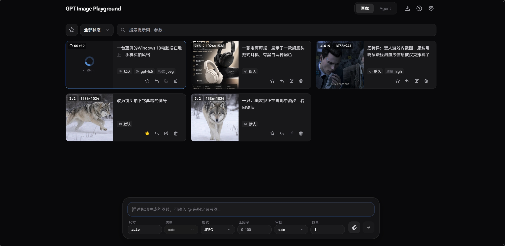
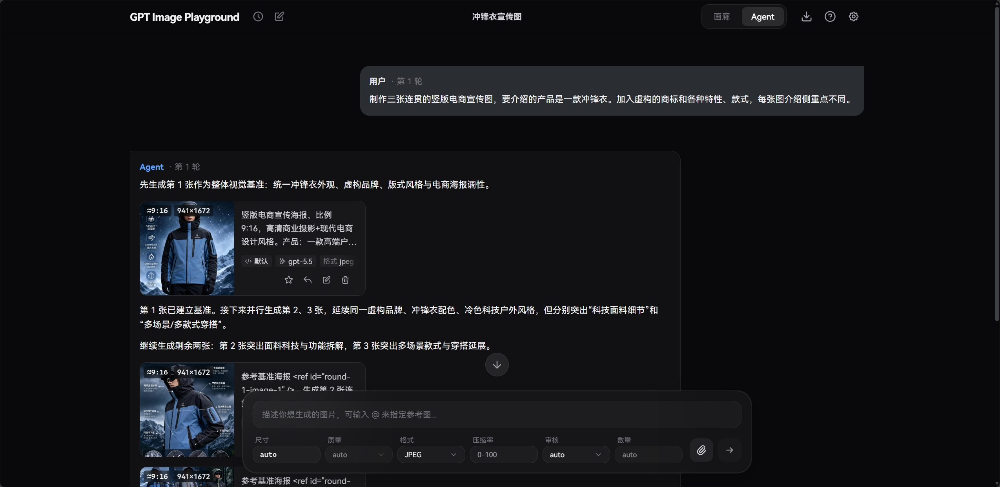
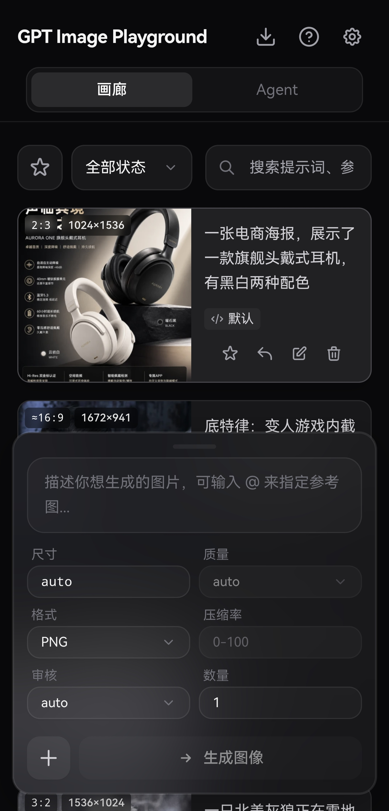

# 🎨 GPT Image-2

**基于 OpenAI gpt-image-2 API 的图片生成与编辑工具**

提供简洁精美的 Web UI，支持 OpenAI / OpenAI 兼容接口、与可导入的自定义 HTTP 服务商。 
支持文本生图、参考图与遮罩编辑，数据纯本地化存储，带来流畅的历史记录与参数管理体验。

 

 

> 💡 **提示**：若需调用非 HTTPS 的内网或本地 HTTP API，请使用 GitHub Pages 版本或自行部署，Vercel 部署的体验版绑定的 `.dev` 域名因安全策略通常要求接口必须为 HTTPS。

---

## 📸 界面预览

<b>点击展开截图展示</b>

 

  <b>桌面端主界面</b> 
  

 

  <b>任务详情与实际参数</b> 
  

 

  <b>桌面端批量选择</b> 
  

 

  <b>桌面端 Agent 模式</b> 
  

 

  <b>移动端主界面</b> 
  

 

  <b>移动端侧滑多选</b> 
  

---

## ✨ 核心特性

### 🎨 强大的图像生成与编辑
- **参考图与遮罩**：支持上传最多 16 张参考图（支持剪贴板和拖拽）。内置可视化遮罩编辑器，自动预处理以符合官方分辨率限制。
- **批量与迭代**：支持单次多图生成；一键将满意结果转为参考图，无缝开启下一轮修改。
- **流式生成预览**：`Images API` 与 `Responses API` 模式均支持流式接收中间步骤图像，缓解连接超时问题。

### 🤖 Agent 多轮对话模式
- **多轮对话与上下文记忆**：基于 Responses API 的对话式生成，Agent 会理解上下文并按需调用图像工具；支持 `@` 引用参考图或前面轮次生成的图片，并自动识别上下文中的图片。
- **并发批量生成**：内置 `generate_image_batch` 工具，让 Agent 在一次轮次中并发生成多张关联图像，并通过 `continue_generation` 自动追加新一轮以处理依赖关系。
- **分支与重新生成**：编辑某轮消息重新发送或重新生成某轮消息会产生可切换的分支，引用解析严格限定在当前分支路径内，避免误用其他分支的图片。
- **画廊同步与隔离删除**：Agent 生成的图片会同步到画廊；删除对话默认保留画廊记录，删除画廊任务时也会自动清理对话中残留的图片引用。
- **可选 Web 搜索**：可开启 `web_search` 工具，Agent 会在需要时搜索网络信息并附带引用链接。

### ⚙️ 精细化参数追踪
- **智能尺寸控制**：提供 1K/2K/4K 快速预设，自定义宽高时会自动规整至模型安全范围（16 的倍数、总像素校验等）。
- **实际参数对比**：自动提取 API 响应中真实生效的尺寸、质量、耗时以及**模型改写后的提示词**，与你的请求参数高亮对比。支持定制化的参数列表横向平滑滚动体验。

### 📁 高效历史管理 (纯本地)
- **瀑布流与画廊**：历史任务自动保存，支持按状态过滤、全屏大图预览与快捷下载。
- **快捷批量操作**：桌面端支持鼠标拖拽框选、Ctrl/⌘ 连选，移动端支持顺滑侧滑多选；轻松实现批量收藏与清理。
- **优化的图片查看与下载**：大图预览支持左右滑动切换、移动端长按弹出操作菜单，支持快捷下载与批量下载。
- **极致性能与隐私**：所有记录与图片均存放在浏览器 IndexedDB 中（采用 SHA-256 去重压缩），不经过任何第三方服务器。支持一键打包导出 ZIP 备份。

### 🔌 多配置与服务商增强
- **多配置管理**：支持创建并保存多个 API 配置（包含服务商、API Key、模型等），按需快速切换；支持一键复制当前配置到列表底部，并通过拖拽对配置列表与服务商列表进行自定义排序。
- **多服务商接入**：内置 OpenAI 兼容接口（含 `Images API` 和 `Responses API`）、fal.ai（支持队列），并支持通过 JSON 导入自定义 HTTP 服务商配置（兼容同步/异步任务）。
- **API 代理**：OpenAI 兼容接口与 fal.ai 均可配置自定义代理。其中 OpenAI 兼容接口可开启同源 `/api-proxy/` 代理，交由 Docker 或本地开发环境转发至真实 API，绕开浏览器 CORS 限制。
- **Codex CLI 兼容模式**：对上游为 Codex CLI 的 API，开启后应用 Codex CLI 实际支持的参数，并将多图生成拆分为并发单图。
- **提示词防改写**：Responses API 会始终在请求文本前加入强制指令防止提示词被改写；开启 Codex CLI 模式后，Images API 也会获得同等保护。
- **智能诊断提示**：当检测到接口异常改写行为或缺少常规参数时，自动提示开启相应的兼容模式。
- **习惯配置**：支持设置提交后清空输入、重启后保留历史输入、临时复用历史任务 API 配置等。

---

## 💻 技术栈

   
  
  
  
  
  
   
   

